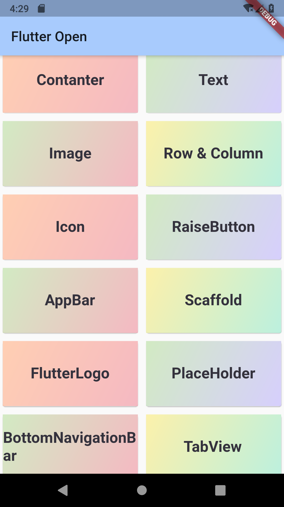
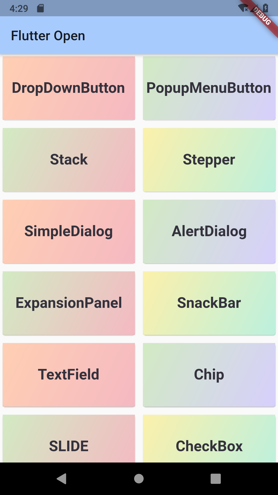
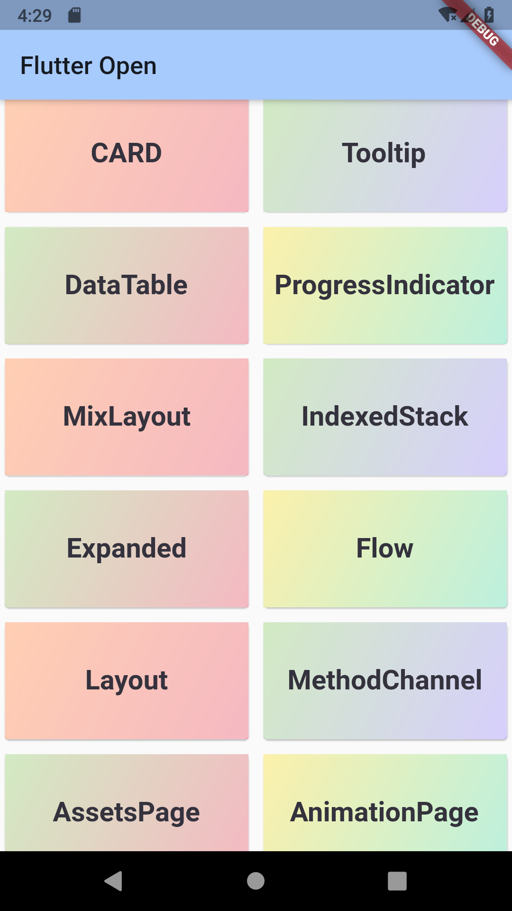
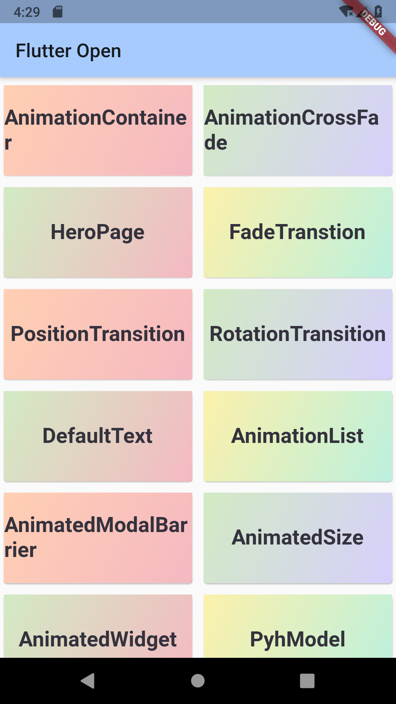
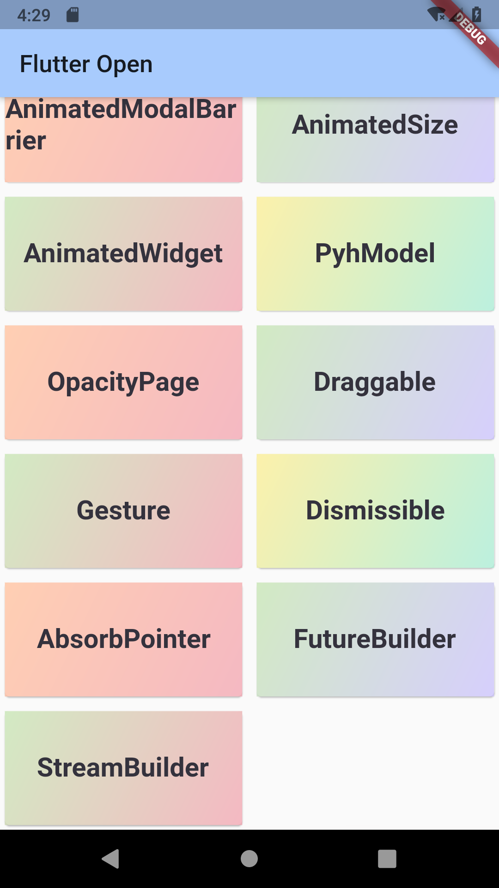

# Flutter Widgets
### :heart: Star :heart: the repo to support the project or :smile:[Follow Me](https://github.com/nb312).Thanks!
Facebook Page| Twitter | QQ Group | Developer |
--- | --- | --- | ---
[Flutter Open ](https://www.facebook.com/flutteropen) | [NieBin](https://twitter.com/niebin_gg) |  963828159 |[NieBin](https://github.com/nb312)  
# What it is?
The Project is a flutter examples of the flutter widgets. Some example contain articles and code about flutter widgets.

The whole artcile is here: [Flutter Widgets articles](https://flutteropen.gitbook.io/flutter-widgets)

### Base widgets
1 | 2 | 3 | 4 | 5 | 6
--- | --- | --- | --- | --- | ---
[Container](https://flutteropen.gitbook.io/widgets/flutter-widgets-01-container) |	[Row/Column](https://flutteropen.gitbook.io/ebook/flutter-open-flutter-widgets-04-row-and-column) | 	[Image](https://flutteropen.gitbook.io/ebook/flutter-open-flutter-widgets-03-image) |	[Text](https://flutteropen.gitbook.io/widgets/flutter-open-flutter-widgets-02-text) |	[Icon](https://flutteropen.gitbook.io/ebook/flutter-open-flutter-widgets-05-icon) | 
[RaiseButton](https://flutteropen.gitbook.io/ebook/widgets-06-or-raisebutton) | [Scaffold](https://medium.com/flutteropen/flutter-widgets-scaffold-8673c0630ed4) |	[AppBar](https://medium.com/flutteropen/flutter-widgets-07-appbar-86cae58244cd) |	[FlutterLogo](https://medium.com/flutteropen/flutter-widgets-09-flutterlogo-5552b9021f8b) |	[PlaceHolder](https://medium.com/flutteropen/flutter-widgets-10-placeholder-f8949a7dc273) |
### Navigation
1 | 2 | 3 | 4 | 5 |
--- | --- | --- | --- | ---
[Scaffold](https://medium.com/flutteropen/flutter-widgets-scaffold-8673c0630ed4) |	[AppBar](https://medium.com/flutteropen/flutter-widgets-07-appbar-86cae58244cd) |	[BottomNavigationBar](https://medium.com/flutteropen/flutter-widgets-11-bottomnavigationbar-3531d625fa0c) |	[TabBar&TabBarView](https://medium.com/flutteropen/flutter-widgets-12-tabbarview-tabbar-4cdc2112991a) |
MaterialApp |	WidgetsApp |	Drawer | |      

### Button
1 | 2 | 3 | 4 | 5 |
--- | --- | --- | --- | ---
[RaiseButton](https://medium.com/flutteropen/widgets-06-raisebutton-6322e0bb2a95)	| FloatingActionButton |	FlatButton |	IconButton |	[DropdownButton](https://medium.com/flutteropen/flutter-widgets-13-dropdownbutton-d21e9c226f04)
[PopupMenuButton](https://medium.com/flutteropen/widgets-14-popupmenubutton-1f1437bbdce2) |	ButtonBar | | |

### Input & selection
1 | 2 | 3 | 4 |
--- | --- | --- | ---
TextField |	CheckBox |	Radio |	Switch
Slider |	Date $Time Pickers | |

### Dialog
1 | 2 | 3 | 4 | 5 |
--- | --- | --- | --- | ---
[SimpleDialog](https://medium.com/flutteropen/flutter-widgets-17-simpledialog-1cf5bfd83f5f) |	AlertDialog |	BottomSheet |	ExpansionPanel |	SnackBar

### Information
1 | 2 | 3 | 4 | 5 |
--- | --- | --- | --- | ---
Image |	Icon |	Chip |	Tooltip |	DataTable |
Card | LinearProgressIndicator | CircularProgressIndicator |	GridView |

### Layout-single
1 | 2 | 3 | 4 
--- | --- | --- | --- 
ListTile |	[Stepper](https://medium.com/flutteropen/flutter-widgets-16-stepper-485ad8d1a248) |	Divider | LimitedBox
Padding |	Center |	Align |	FittedBox |	AspectRatio 
Baseline |	FractionallySizedBox |	IntrinsicHeight
OverflowBox |	SizedBox |	SizedOverflowBox |	Transform 
ConstrainedBox |  Offstage | CustomSingleChildLayout | IntrinsicWidth

### Layout-muti
1 | 2 | 3 | 4 | 5
--- | --- | --- | --- | --
Row	| Column |	[Stack](https://medium.com/flutteropen/flutter-widgets-15-stack-9637858f7c62) |	IndexedStack | Expanded
GridView |	Flow | Table |	Wrap |
ListBody |	CustomMultiChildLayout |	LayoutBuilder |	ListView  |

### Assets
Text | Asset | Input
--- | --- | ---
Text |	Image |	Form
RichText |	Icon |	FormField
DefaultTextStyle | RawImage	|	RawKeyBoardListener
AssetBundle | |

### Animation
1 | 2 | 3 | 4 
--- | --- | --- | ---
Animation |	AnimatedContainer |	AnimatedCrossFade |	Hero 
FadeTransition | PositionedTransition |	RotationTransion	| ScaleTransition 
AnimatedDefaultTextStyle | AnimatedListState |	AnimatedModalBarrier |		 
AnimatedSize | AnimatedWidget |	AnimatedWidgetBaseState | DecoratedTransition 
SlideTransition | AnimatedPhysicalModel | AnimatedPositioned | AnimatedBuilder
SizeTransition | AnimatedOpacity | 

### Interaction
1 | 2 | 3 | 4 | 5 |
--- | --- | --- | --- | ---
Draggable |	LongPressDraggable |	GestureDetector |	DragTarget |	Dismissible
AbsorbPointer |	Scrollable |	Hero |	Navigator | IgnorePointer

Style | Async | Accessibility
--- | --- | ---
Padding	|	FutureBuilder | Semantic
Theme |	StreamBuilder | MergeSemantics
MediaQuery |		|	ExcludeSemantics

### Painting & Effect
1 | 2 | 3 | 4 | 5 |
--- | --- | --- | --- | ---
Opacity |	Transform |	DecoratedBox |	FractionalTranslation |	RotatedBox
ClipOval | ClipPath |	ClipRect |	CustomPaint |	BackdropFilter

### Scrolling
[This part link](https://github.com/nb312/flutter-layouts-exampls)

1 | 2 | 3 | 4 
--- | --- | --- | --- 
GridView |	ListView |	NestedScrollView | 	SingleChildScrollView		
CustomScrollview |	NotificationListener |	ScrollConfiguration 
Scrollable |  PageView | Scrollable | RefreshIndicator
