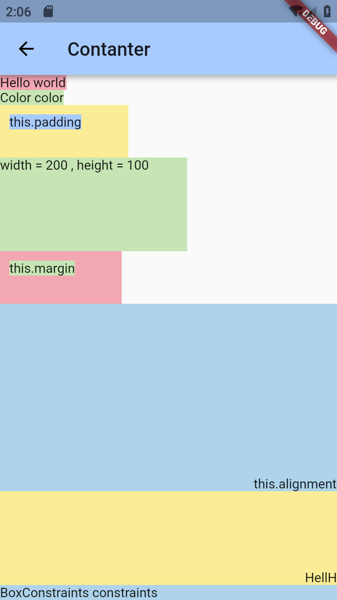
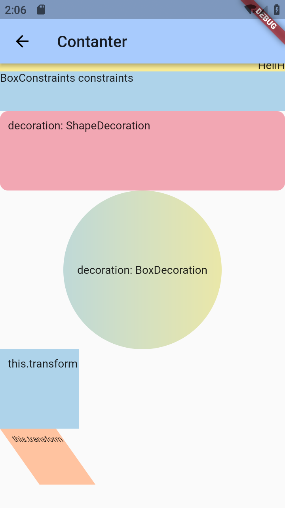
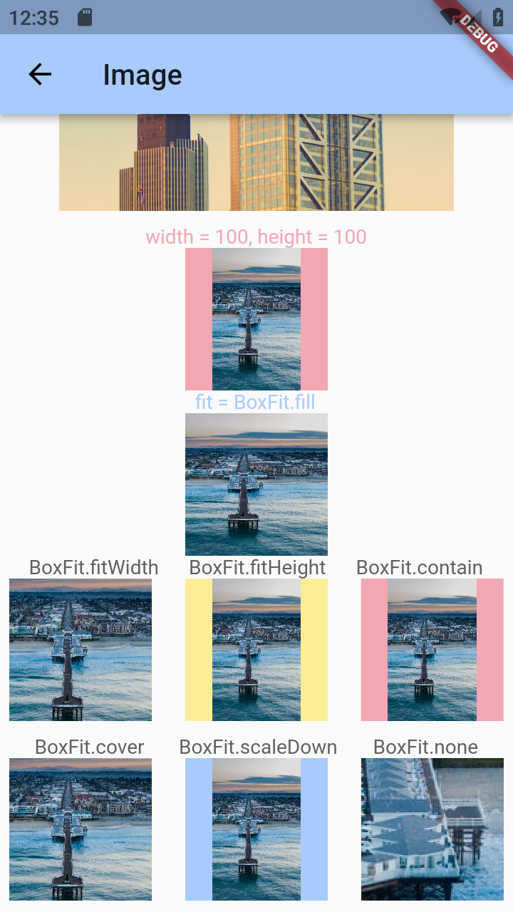
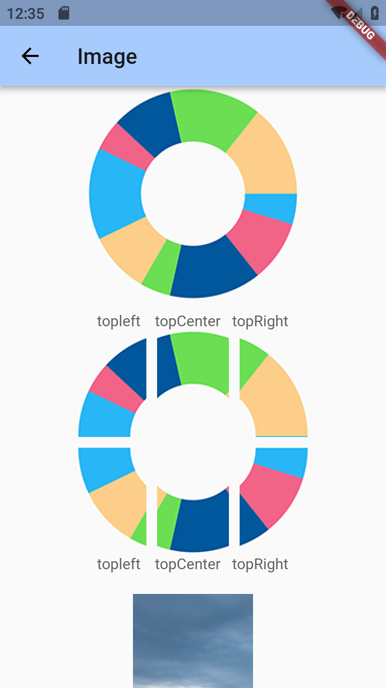
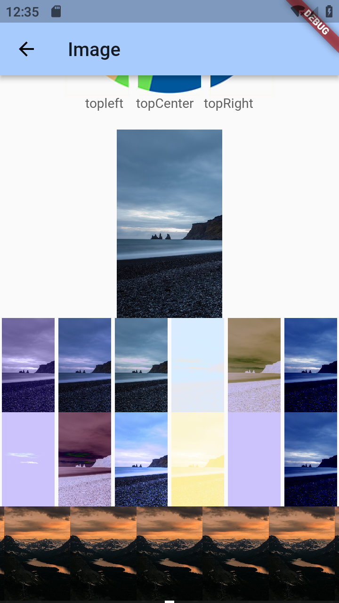
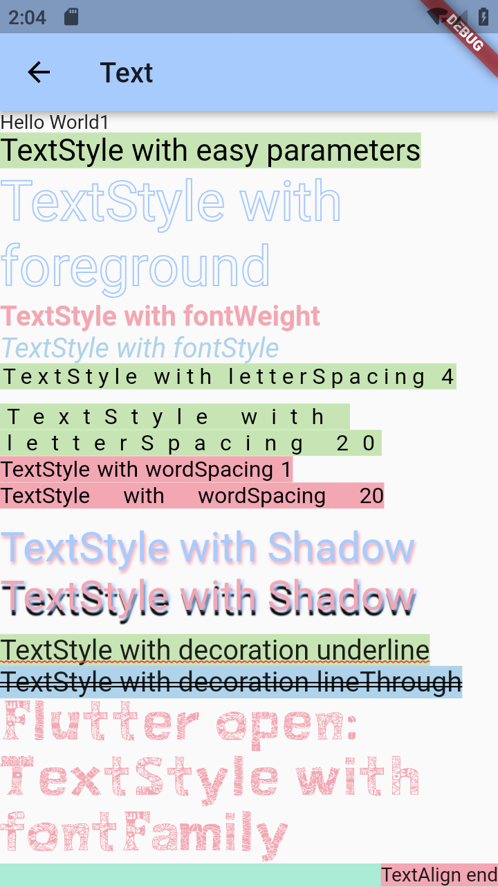
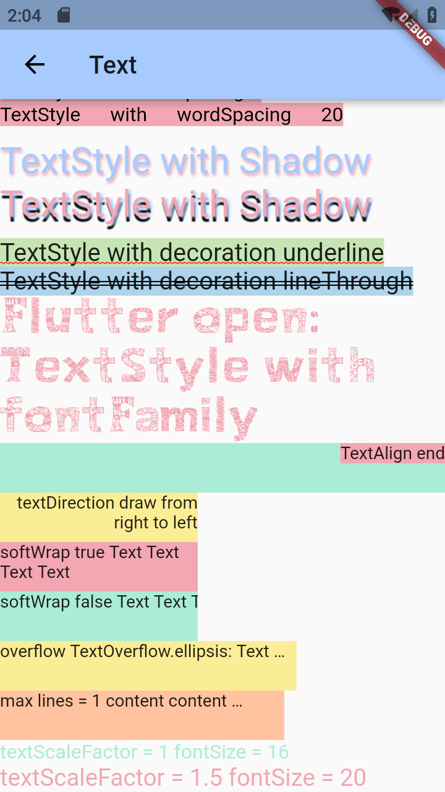

# ebook
### :heart: Star :heart: the repo to support the project or :smile:[Follow Me](https://github.com/nb312).Thanks!
Facebook Page| Twitter | QQ Group | Developer |
--- | --- | --- | ---
[Flutter Open ](https://www.facebook.com/flutteropen) | [NieBin](https://twitter.com/niebin_gg) |  963828159 |[NieBin](https://github.com/nb312)  
# What is the ebook
The ebook is a book that contains articles and code about flutter widgets.I will write articles about these widgets list below. If the widgets has the link means I have done them, otherwise are not. The whole artcile is here: [ebook articles](https://flutteropen.gitbook.io/widgets/)
### Base widgets
1 | 2 | 3 | 4 | 5 | 6
--- | --- | --- | --- | --- | ---
[Container](https://flutteropen.gitbook.io/widgets/flutter-widgets-01-container) |	Row | 	Column | 	[Image](https://flutteropen.gitbook.io/ebook/flutter-open-flutter-widgets-03-image) |	[Text](https://flutteropen.gitbook.io/widgets/flutter-open-flutter-widgets-02-text) |	Icon
 | | | | 
RaiseButton | Scaffold |	AppBar |	FlutterLogo |	PlaceHolder |

### Navigation
1 | 2 | 3 | 4 | 5 |
--- | --- | --- | --- | ---
Scaffold |	AppBar |	BottomNavigationBar |	TabBar |	TabBarView
MaterialApp |	WidgetsApp |	Drawer | |

### Button
1 | 2 | 3 | 4 | 5 |
--- | --- | --- | --- | ---
RaiseButton	| FloatingActionButton |	FlatButton |	IconButton |	DropdownButton
PopupMenuButton |	ButtonBar | | |

### Input & selection
1 | 2 | 3 | 4 |
--- | --- | --- | ---
TextField |	CheckBox |	Radio |	Switch
Slider |	Date $Time Pickers | |

### Dialog
1 | 2 | 3 | 4 | 5 |
--- | --- | --- | --- | ---
SimpleDialog |	AlertDialog |	BottomSheet |	ExpansionPanel |	SnackBar

### Information
1 | 2 | 3 | 4 | 5 |
--- | --- | --- | --- | ---
Image |	Icon |	Chip |	Tooltip |	DataTable |
Card | LinearProgressIndicator | CircularProgressIndicator |	GridView |

### Layout-single
1 | 2 | 3 | 4 
--- | --- | --- | --- 
ListTile |	Stepper |	Divider | LimitedBox
Padding |	Center |	Align |	FittedBox |	AspectRatio 
Baseline |	FractionallySizedBox |	IntrinsicHeight
OverflowBox |	SizedBox |	SizedOverflowBox |	Transform 
ConstrainedBox |  Offstage | CustomSingleChildLayout | IntrinsicWidth

### Layout-muti
1 | 2 | 3 | 4 | 5
--- | --- | --- | --- | --
Row	| Column |	Stack |	IndexedStack | Expanded
GridView |	Flow | Table |	Wrap |
ListBody |	CustomMultiChildLayout |	LayoutBuilder |	ListView  |

### Assets
Text | Asset | Input
--- | --- | ---
Text |	Image |	Form
RichText |	Icon |	FormField
DefaultTextStyle | RawImage	|	RawKeyBoardListener
AssetBundle | |

### Animation
1 | 2 | 3 | 4 
--- | --- | --- | ---
Animation |	AnimatedContainer |	AnimatedCrossFade |	Hero 
FadeTransition | PositionedTransition |	RotationTransion	| ScaleTransition 
AnimatedDefaultTextStyle | AnimatedListState |	AnimatedModalBarrier |		 
AnimatedSize | AnimatedWidget |	AnimatedWidgetBaseState | DecoratedTransition 
SlideTransition | AnimatedPhysicalModel | AnimatedPositioned | AnimatedBuilder
SizeTransition | AnimatedOpacity | 

### Interaction
1 | 2 | 3 | 4 | 5 |
--- | --- | --- | --- | ---
Draggable |	LongPressDraggable |	GestureDetector |	DragTarget |	Dismissible
AbsorbPointer |	Scrollable |	Hero |	Navigator | IgnorePointer

Style | Async | Accessibility
--- | --- | ---
Padding	|	FutureBuilder | Semantic
Theme |	StreamBuilder | MergeSemantics
MediaQuery |		|	ExcludeSemantics

### Painting & Effect
1 | 2 | 3 | 4 | 5 |
--- | --- | --- | --- | ---
Opacity |	Transform |	DecoratedBox |	FractionalTranslation |	RotatedBox
ClipOval | ClipPath |	ClipRect |	CustomPaint |	BackdropFilter

### Scrolling
1 | 2 | 3 | 4 
--- | --- | --- | --- 
GridView |	ListView |	NestedScrollView | 	SingleChildScrollView		
CustomScrollview |	NotificationListener |	ScrollConfiguration 
Scrollable |  PageView | Scrollable | RefreshIndicator
